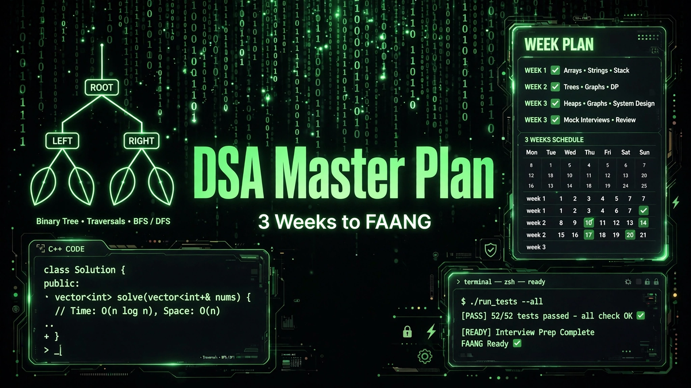

# 3-Week DSA Master Plan

> ## Status: 🟡 In Progress
>
> <progress value="60" max="100"></progress>
>
> **Progress: 60%** — The full 3-week plan is written and Day 1–2 code exists; most daily problem solutions are still to be written

<p align="center">
  
</p>


## What it is

A structured 3-week FAANG interview-prep plan in C++: 21 days, 3–5 hours a day, one topic → one pattern → multiple problems. Week 1 covers C++ STL, arrays, and strings; Week 2 covers core data structures (linked lists, stacks, trees, heaps, graphs); Week 3 covers greedy algorithms and dynamic programming. The repo also holds starter C++ practice files and a Python watcher that auto-commits your daily progress.

## What works (verified)

- ✅ **Complete 21-day plan** — every day has topics, concepts to learn, and specific problems (see The Plan below)
- ✅ **Starter C++ code** — `vector.cpp` (304 lines: vector ops, STL algorithms), `basic_question.cpp`
- ✅ **Auto-commit watcher** — `watcher.py` + `auto_commit.py` track and commit your practice files
- ✅ **Daily rules** — dry-run before coding, explain aloud, mistake notebook

## Tech stack

| Layer | Tech |
|---|---|
| Practice language | C++ (STL) |
| Tooling | Python (file watcher, auto-commit) |
| Compiler | Any C++17 compiler (`g++`/`clang++`) |

## How to run

You need a **C++17 compiler** and **Python 3**.

```bash
# Compile and run a practice file
g++ -std=c++17 vector.cpp -o vector && ./vector

# Start the auto-commit watcher (commits your daily practice)
python3 watcher.py
```

## Screenshots

Not applicable — this is a study plan + code practice repo, not a UI project. The banner above is generated.

## What you can add more

- [ ] **Solve and commit each day** — the plan is written; the code for Days 3–21 is the work
- [ ] **Track checkboxes** — flip the ☐ to ☑ as you complete days (or move to a tracker)
- [ ] **Time each session** — add timed problem-solving to simulate interview pressure
- [ ] **Mock interviews** — Day 21 calls for one; schedule it with a peer
- [ ] **Mistake notebook** — keep the `notes/` log the plan asks for

## Project structure

```
├── README.md             # This file (plan preserved below)
├── basic_question.cpp    # Starter problem solutions
├── vector.cpp            # Day 1–2: vector ops + STL algorithms (304 lines)
├── watcher.py            # File watcher for practice sessions
├── auto_commit.py        # Auto-commits practice files with progress messages
├── banner.webp
└── .vscode/              # Editor config
```

## The 3-week plan

<details>
<summary>Click to expand the full day-by-day plan</summary>

**Language:** C++ · **Daily Time:** 3–5 hours · **Rule:** One topic → One pattern → Multiple problems

### 🔥 WEEK 1 – C++ STL + ARRAYS + STRINGS (FOUNDATION)

**Day 1 – C++ `vector` (basics):** what a vector is, dynamic resizing, indexing & iteration, `push_back()`, `pop_back()`, `size()`, `empty()`. Tasks: reverse a vector, find max & min, sum of elements, rotate by k.

**Day 2 – Vector + STL algorithms:** pass by reference, `sort()`, `reverse()`, `find()`. Problems: Two Sum, Move Zeroes, Remove Duplicates from Sorted Array.

**Day 3 – Arrays + prefix sum:** array vs vector, prefix sums. Problems: Maximum Subarray (Kadane), Best Time to Buy & Sell Stock, Product of Array Except Self.

**Day 4 – Strings (very important):** `string` basics, `length()`, `substr()`, ASCII. Problems: Reverse String, Valid Palindrome, Valid Anagram, Longest Common Prefix.

**Day 5 – Strings + sliding window:** frequency arrays, `unordered_map<char,int>`. Problems: Longest Substring Without Repeating Characters, Find All Anagrams, String Compression.

**Day 6 – Hashing:** `unordered_map`, `unordered_set`. Problems: Subarray Sum Equals K, Majority Element, First Unique Character.

**Day 7 – Revision:** re-solve 3 array + 3 string problems, write vector ops from memory, log mistakes.

### 🌳 WEEK 2 – CORE DATA STRUCTURES

**Day 8 – Linked list:** node structure, fast & slow pointers. Problems: Reverse Linked List, Detect Cycle, Merge Two Sorted Lists.

**Day 9 – Stack & queue:** `stack`, `queue`, `deque`. Problems: Valid Parentheses, Min Stack, Next Greater Element, Daily Temperatures.

**Day 10 – Binary trees:** TreeNode, DFS vs BFS. Problems: inorder/preorder/postorder traversal, Maximum Depth.

**Day 11 – Tree patterns:** Diameter, Path Sum, Lowest Common Ancestor, Balanced Binary Tree.

**Day 12 – BST + heap:** `priority_queue`. Problems: Validate BST, Kth Smallest in BST, Top K Frequent Elements.

**Day 13 – Graphs:** adjacency lists, BFS & DFS. Problems: Number of Islands, Flood Fill, Course Schedule.

**Day 14 – Revision:** re-solve 5 tree + 2 graph problems, one timed contest.

### 🧠 WEEK 3 – GREEDY + DYNAMIC PROGRAMMING

**Day 15 – Greedy:** Jump Game, Gas Station, Activity Selection.

**Day 16 – DP basics:** memoization, tabulation. Problems: Fibonacci (all approaches), Climbing Stairs, House Robber.

**Day 17 – DP on arrays:** Coin Change, Longest Increasing Subsequence, Maximum Product Subarray.

**Day 18 – DP on strings:** Longest Common Subsequence, Longest Palindromic Subsequence, Edit Distance.

**Day 19 – DP on grids:** Unique Paths, Minimum Path Sum, Maximum Square.

**Day 20 – Mixed FAANG practice:** Merge Intervals, Decode Ways, Product of Array Except Self, Daily Temperatures.

**Day 21 – Final day:** re-solve hardest 10, explain aloud, mock interview.

### 🏆 Daily non-negotiable rules

Dry run before coding · explain approach aloud · write clean STL code · maintain a mistake notebook.

</details>

---
*README written after code audit on 2026-10-08.*
